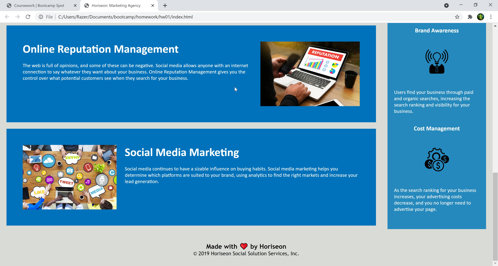

# Assignment
1: Code Refactoring

## My Goal
The goal with this homework to change a couple HTML tags to semantic and more meanigful tags. All of the images needed alt elements for when they don't display an image. I also had to change the title of the page so it had something more meaningful then just a generic name.

## Screenshot

## Link to Deployed Page
https://tanneroliver.github.io/semantic-tagging/
